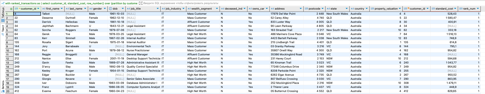

# Основные операторы PostgreSQL

## Задание
Научиться работать с основными операторами PostgreSQL, фильтровать таблицы по разным условиям, писать вложенные запросы, объединять таблицы.

### Задачи:
Дано два csv-файла с данными о клиентах (customer.csv) и их транзакциях (transaction.csv).
Необходимо выполнить следующее:
1. Создать таблицы со следующими структурами и загрузить данные из csv-файлов. Детали приведены ниже.
2. Выполнить следующие запросы:
- Вывести все уникальные бренды, у которых стандартная стоимость выше 1500 долларов.
- Вывести все подтвержденные транзакции за период '2017-04-01' по '2017-04-09' включительно.
- Вывести все профессии у клиентов из сферы IT или Financial Services, которые начинаются с фразы 'Senior'.
- Вывести все бренды, которые закупают клиенты, работающие в сфере Financial Services
- Вывести 10 клиентов, которые оформили онлайн-заказ продукции из брендов 'Giant Bicycles', 'Norco Bicycles', 'Trek Bicycles'.
- Вывести всех клиентов, у которых нет транзакций.
- Вывести всех клиентов из IT, у которых транзакции с максимальной стандартной стоимостью.
- Вывести всех клиентов из сферы IT и Health, у которых есть подтвержденные транзакции за период '2017-07-07' по '2017-07-17'.

---

## **1. Создать таблицы со и загрузить данные из csv-файлов**

### Первые строки таблиц
customers — информация о клиенте     


transactions — покупки клиента


### Создание таблиц, проверка и загрузка данных в таблицы 
Создание таблиц, проверка и загрузка данных в таблицы + изменение формата даты, т.к. изначальный формат выдавал ошибку. Также в исходных данных в transaction были заменены запятые на точки, т.к. запятые были использованы как разделитель.
```dbml
create table customer (
    customer_id int primary key,
    first_name text,
    last_name text,
    gender varchar(10),
    DOB date,
    job_title text,
    job_industry_category text,
    wealth_segment text,
    deceased_indicator char(1),
    owns_car varchar(3),
    address text,
    postcode int,
    state text,
    country text,
    property_valuation int
);

create table transaction (
    transaction_id int primary key,
    product_id int,
    customer_id int references customer(customer_id),
    transaction_date date,
    online_order boolean,
    order_status text,
    brand text,
    product_line text,
    product_class text,
    product_size text,
    list_price numeric,
    standard_cost numeric
);

select table_name 
from information_schema.tables 
where table_schema = 'public';

select column_name, data_type, character_maximum_length 
from information_schema.columns 
where table_name = 'customer';

select column_name, data_type, character_maximum_length 
from information_schema.columns 
where table_name = 'transaction';

copy customer from '/Users/ekaterina.dorokhova/Desktop/ХОД/ДЗ 2/customer.csv' 
with (format csv, header true, delimiter ';');

set datestyle = 'ISO, DMY';

copy transaction from '/Users/ekaterina.dorokhova/Desktop/ХОД/ДЗ 2/transaction3.csv' 
with (format csv, header true, delimiter ',');
```
## **2. Запросы**

### 1) Вывести все уникальные бренды, у которых стандартная стоимость выше 1500 долларов.

```dbml
select * 
from transaction 
where standard_cost > 1500;
```


### 2) Вывести все подтвержденные транзакции за период '2017-04-01' по '2017-04-09' включительно.

```dbml
select * 
from transaction 
where order_status = 'Approved' 
and transaction_date between '2017-04-01' and '2017-04-09';
```


### 3) Вывести все профессии у клиентов из сферы IT или Financial Services, которые начинаются с фразы 'Senior'.

```dbml
select * 
from customer 
where job_industry_category in ('IT', 'Financial Services') 
and job_title like 'Senior%';
```


### 4) Вывести все бренды, которые закупают клиенты, работающие в сфере Financial Services

```dbml
select t.*, c.* 
from transaction t 
inner join customer c on t.customer_id = c.customer_id 
where c.job_industry_category = 'Financial Services';
```


### 5) Вывести 10 клиентов, которые оформили онлайн-заказ продукции из брендов 'Giant Bicycles', 'Norco Bicycles', 'Trek Bicycles'.

```dbml

```


### 6) Вывести всех клиентов, у которых нет транзакций.

```dbml

```


### 7) Вывести всех клиентов из IT, у которых транзакции с максимальной стандартной стоимостью.

```dbml

```


### 8) Вывести всех клиентов из сферы IT и Health, у которых есть подтвержденные транзакции за период '2017-07-07' по '2017-07-17'.

```dbml

```

